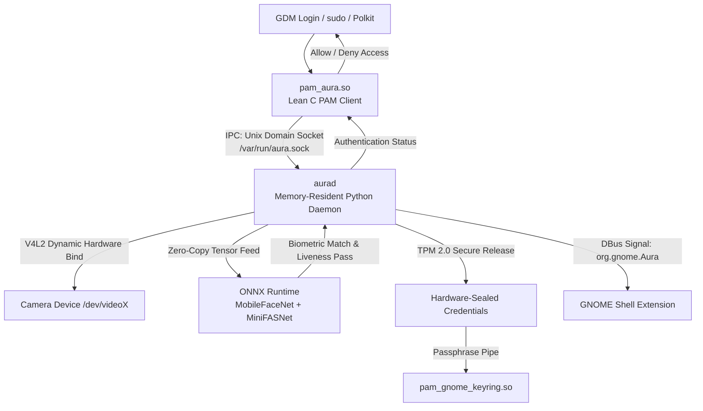

# Aura: Edge-Optimized Facial Authentication for Linux
### Master Architecture Specification & Development Roadmap

Aura is a lightweight, low-latency biometric facial verification service designed specifically for modern Linux desktop environments running Wayland and the GNOME ecosystem. This document serves as the single source of truth for the system architecture, component boundaries, and implementation steps.


## Docs

| Doc | Purpose |
|-----|---------|
| **[docs/STATUS.md](./docs/STATUS.md)** | Handoff status |
| [docs/setup.md](./docs/setup.md) | Setup |
| [AGENTS.md](./AGENTS.md) | Agent guidance |

---

## 1. System Architecture Overview

Aura avoids the common anti-pattern of executing heavy runtimes or file I/O operations directly inside the Pluggable Authentication Modules (PAM) memory space. Instead, it utilizes a decoupled **Client-Daemon Architecture** linked via high-speed Inter-Process Communication (IPC).



### Component Boundaries

1. **`pam_aura.so` (The Client):** A lightweight C binary loaded into the calling process (e.g., GDM or `sudo`). It contains zero machine learning logic, handles no camera hardware, and has an immediate fail-safe bypass.
2. **`aurad` (The Daemon):** A persistent `systemd` background service running a Python runtime. It holds the core neural networks resident in memory, manages state transitions, and controls hardware access.
3. **`Aura Configuration Manager` (The GUI):** A standalone GTK4/Libadwaita application for face enrollment, confidence configuration, and hardware mapping.
4. **`Aura UI Shell` (The Visuals):** A GNOME Shell Extension interacting via DBus to display real-time feedback animations during authentication events.

---

## 2. Technical Stack Reference

| Layer | Component | Implementation |
| :--- | :--- | :--- |
| **Authentication Hook** | Core System Integration | Linux PAM (`libpam-dev`) / Standard C |
| **Service Engine** | Background Lifecycle | `systemd` / Python 3.11+ |
| **Hardware Access** | Camera Frame Processing | Video4Linux2 (`v4l2-ctl`) / Optimized OpenCV |
| **Inference Runtime** | Mathematical Execution | **ONNX Runtime** (C++ compilation target acceleration) |
| **Machine Learning Models** | Deep Learning Models | Quantized **MobileFaceNet** (Verification) + **MiniFASNet** (Liveness) |
| **Local IPC** | Low-Overhead Transit | Unix Domain Sockets (`/var/run/aura.sock`) |
| **Desktop Signals** | Session Broadcasting | System Bus DBus (`pydbus`) |
| **Credential Storage** | Cryptographic Vault | **TPM 2.0** Infrastructure (`tpm2-tss`) |
| **User Interface** | Control Panel Configuration | `PyGObject` (GTK4 + Libadwaita) |
| **Desktop Integration** | Compositor Presentation | GNOME JavaScript (GJS) Shell Extension |

---

## 3. Component Deep Dives

### A. The Fail-Safe PAM Client (`pam_aura.c`)
The PAM module must remain highly deterministic. It connects to the UNIX socket, writes the acting username, waits for a single-byte confirmation, and exits. 

```c
#include <stdio.h>
#include <stdlib.h>
#include <string.h>
#include <unistd.h>
#include <sys/socket.h>
#include <sys/un.h>
#include <security/pam_appl.h>
#include <security/pam_modules.h>

#include "aura_ipc.h" // Shared socket layout definitions

PAM_EXTERN int pam_sm_authenticate(pam_handle_t *pamh, int flags, int argc, const char **argv) {
    const char *username = NULL;
    if (pam_get_user(pamh, &username, NULL) != PAM_SUCCESS || !username) {
        return PAM_AUTH_ERR;
    }

    int sock = socket(AF_UNIX, SOCK_STREAM, 0);
    if (sock < 0) return PAM_AUTH_ERR; // Instant fail-safe fallback

    struct sockaddr_un addr;
    memset(&addr, 0, sizeof(addr));
    addr.sun_family = AF_UNIX;
    strncpy(addr.sun_path, SOCKET_PATH, sizeof(addr.sun_path) - 1);

    // Set a strict 1.5-second timeout to prevent terminal hangs
    struct timeval tv;
    tv.tv_sec = 1;
    tv.tv_usec = 500000;
    setsockopt(sock, SOL_SOCKET, SO_RCVTIMEO, (const char*)&tv, sizeof(tv));

    if (connect(sock, (struct sockaddr*)&addr, sizeof(addr)) < 0) {
        close(sock);
        return PAM_AUTH_ERR; // Daemon not running; fallback to password
    }

    // Packet Structure: USERNAME
    write(sock, username, strlen(username));

    char response = 0;
    int bytes_read = read(sock, &response, 1);
    close(sock);

    if (bytes_read == 1 && response == AUTH_SUCCESS_BYTE) {
        return PAM_SUCCESS;
    }

    return PAM_AUTH_ERR; // Failures default instantly to password entry
}
```

### B. The Memory-Resident Daemon Framework (`aurad.py`)
The Python daemon handles process management, IPC parsing, and model orchestration. By wrapping execution routines inside an ONNX runtime environment, performance targets match raw native execution loops.

```python
import os
import socket
import sys
import onnxruntime as ort
import cv2
import numpy as np

SOCKET_PATH = "/var/run/aura.sock"
MODEL_PATH = "/usr/share/aura/models/mobilefacenet_quantized.onnx"

class AuraDaemon:
    def __init__(self):
        # Enforce C++ optimization backends under the hood
        self.ort_session = ort.InferenceSession(
            MODEL_PATH, 
            providers=['CPUExecutionProvider']
        )
        self.camera_device = None
        self.is_active = False

    def init_hardware(self):
        """Dynamic camera node discovery via V4L2 strings"""
        # Scan system configurations instead of hardcoding /dev/video0
        # If an IR camera format is flagged, select it directly
        self.camera_device = cv2.VideoCapture(0, cv2.CAP_V4L2)
        
    def calculate_embedding(self, face_frame):
        # Run optimized inference via the ONNX shared memory matrix
        blob = cv2.dnn.blobFromImage(face_frame, 1.0/127.5, (112, 112), (127.5, 127.5, 127.5), swapRB=True)
        ort_inputs = {self.ort_session.get_inputs()[0].name: blob}
        ort_outs = self.ort_session.run(None, ort_inputs)
        return ort_outs[0]

    def verify_identity(self, username):
        self.init_hardware()
        ret, frame = self.camera_device.read()
        self.camera_device.release() # Release hardware lock immediately
        
        if not ret:
            return b'\x00'
            
        # Mock structural verification flow:
        # 1. Run MiniFASNet Face Anti-Spoofing/Liveness validation
        # 2. Extract facial crop matrices
        # 3. Compute vector distance mapping
        
        # Vector Verification Logic:
        # Cosine Similarity = (A · B) / (||A|| ||B||)
        
        match_authenticated = True 
        return b'\x01' if match_authenticated else b'\x00'

    def run(self):
        if os.path.exists(SOCKET_PATH):
            os.remove(SOCKET_PATH)

        server = socket.socket(socket.AF_UNIX, socket.SOCK_STREAM)
        server.bind(SOCKET_PATH)
        os.chmod(SOCKET_PATH, 0o666) # Ensure accessibility across services
        server.listen(5)

        while True:
            conn, _ = server.accept()
            data = conn.recv(1024)
            if data:
                username = data.decode('utf-8')
                result = self.verify_identity(username)
                conn.sendall(result)
            conn.close()

if __name__ == "__main__":
    daemon = AuraDaemon()
    daemon.run()
```

### C. True Passwordless Infrastructure: TPM 2.0 Integration
To fully bypass secondary password challenges when mounting user desktop spaces, Aura leverages the platform’s **Trusted Platform Module (TPM 2.0)** to securely store the keyring passphrase.

* **Sealing Strategy:** The system user's login password is encrypted via the TPM's Storage Root Key (SRK) and bound to **PCR 0 (Firmware Integrity)**, **PCR 7 (Secure Boot Status)**, and a dedicated cryptographic handle.
* **Release Flow:** Upon verification, `aurad` triggers an authenticated request to unseal the passphrase stream directly into the system's memory subsystem, providing `pam_gnome_keyring.so` with the decryption key without manual user intervention.

```bash
# Reference deployment commands for TPM 2.0 provisioning
# 1. Generate a primary storage object key
tpm2_createprimary -C o -g sha256 -G rsa -c primary.ctx

# 2. Seal the keyring passphrase against strict system integrity registers (PCR 0 and 7)
echo "user_secret_passphrase" | tpm2_create -C primary.ctx -g sha256 -G keyedhash -u obj.pub -r obj.priv -L pcr_policy.pol -i-

# 3. Load the policy object into operational system structures
tpm2_load -C primary.ctx -u obj.pub -r obj.priv -c object.ctx

# 4. Unseal operations are executed programmatically by the daemon using TSS system bindings
tpm2_unseal -c object.ctx -p pcr:0,7
```

---

## 4. Operational Configuration Blueprint

To inject Aura into the system authentication pipeline cleanly, configure the PAM target stacks to treat facial validation as a `sufficient` condition.

### System Configuration `/etc/pam.d/sudo`
```ini
#%PAM-10.0
auth        sufficient    pam_aura.so
auth        include       system-auth
account     include       system-auth
session     include       system-auth
```

### System Configuration `/etc/pam.d/gdm-password`
```ini
#%PAM-10.0
auth        revert        pam_aura.so
auth        sufficient    pam_gnome_keyring.so only_if_tpm_unsealed
auth        include       system-local-login
account     include       system-local-login
session     include       system-local-login
```

---

## 5. Development Roadmap & Milestones

### Phase 1: Machine Learning Environment Optimization (Milestone 1)
* [ ] Compile a Python virtual environment with specialized `onnxruntime-openvino` or hardware-specific acceleration.
* [ ] Benchmark `MobileFaceNet` inference times on sample facial datasets to guarantee performance targets fall under 50ms.
* [ ] Implement an automated image pipeline mapping facial landmark anchors to normalize raw frame inputs.

### Phase 2: Asynchronous Communication Engine (Milestone 2)
* [ ] Solidify socket-layer network configurations in `aurad.py` to prevent data collision.
* [ ] Implement low-level DBus hooks via Python's `pydbus` library to handle desktop-wide session state synchronization.
* [ ] Construct a strict `systemd` process definition profile (`/usr/lib/systemd/system/aurad.service`) complete with restricted execution policies.

### Phase 3: Compilation of the System Gateway (Milestone 3)
* [ ] Write a modular `Makefile` to compile `pam_aura.c` targeting native platform architectures (`-shared -fPIC`).
* [ ] Execute testing procedures against the local PAM module using isolated binary configurations (`pamtester`) to protect system stability.
* [ ] Implement a watchdog routine inside the C library to gracefully exit if the local UNIX socket path drops connections.

### Phase 4: GTK4 Architecture & Desktop Integration (Milestone 4)
* [ ] Design a responsive UI layout using **Blueprint UI** definitions, and compile the assets into native GResource bundles.
* [ ] Build vector enrollment workflows in PyGObject to store facial profiles safely in `/var/lib/aura/profiles/`.
* [ ] Write a native GNOME Shell JavaScript extension to capture state signals, overlaying scanning feedback onto the desktop locking interface.

---

## 6. Target Performance & Metrics Tracker
When displaying this architecture to technical hiring managers, validate system performance against these metrics:

* **Inference Speed:** Target $\le$ 50ms per individual image evaluation frame.
* **System Footprint:** Limit idle memory allocation to $\le$ 15MB total RAM.
* **Fail-Safe Integrity:** 100% of socket failure anomalies must default immediately to standard password entry blocks, causing zero application hangs.