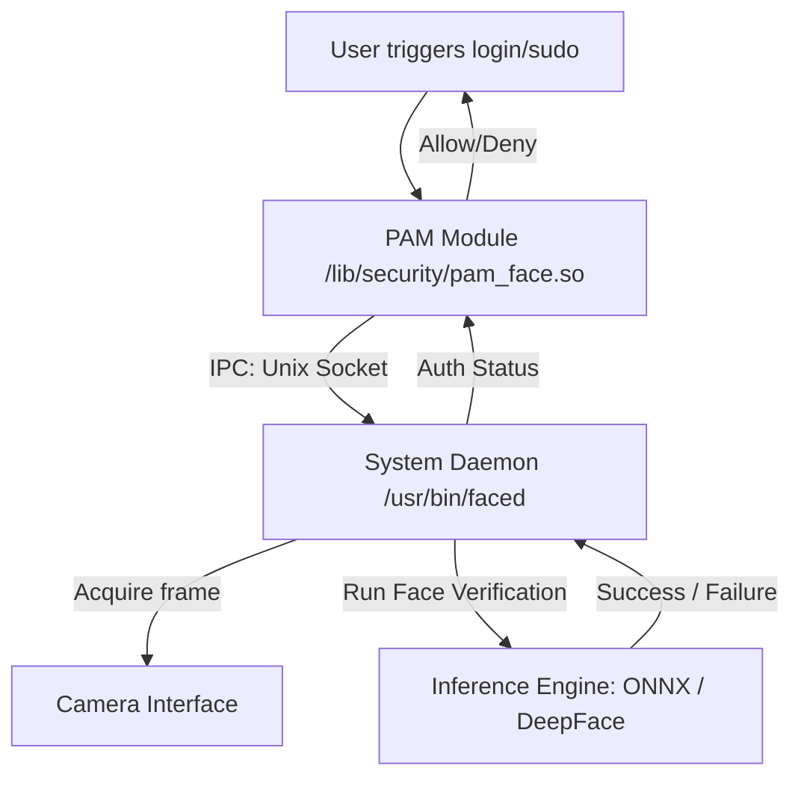

# Linux Biometric Login Service: Architectural Blueprint

This document details the feasibility and architectural design of a Linux-native biometric login service (similar to Windows Hello or Howdy) using modern face verification, Pluggable Authentication Modules (PAM) integration, and GNOME Keyring unlocking.

---

## 👁️ Face Verification vs. Emotion Detection

The current project classifies *emotions*. For authentication, the system must perform **Face Verification** (matching a live capture against an enrolled face template).

Fortunately, `DeepFace` (already in the project stack) includes face verification out of the box:
```python
from deepface import DeepFace

# Verify if a live frame matches the enrolled user profile
result = DeepFace.verify(
    img1_path="live_frame.jpg",
    img2_path="enrolled_profile.jpg",
    model_name="ArcFace",          # High-accuracy model
    detector_backend="opencv",     # Or 'retinaface' for better accuracy
    enforce_detection=True
)

is_authenticated = result["verified"]
```

---

## 🏗️ System Architecture

Running a heavy framework like TensorFlow/Keras directly inside a PAM module is unsafe and slow. PAM modules run inside the address space of the calling process (like `sudo` or `gdm-password`), which can cause dependency conflicts, memory leaks, and long startup times (TensorFlow initialisation takes ~8 seconds).

Instead, a **Daemon-Client Architecture** is required:



### 1. The PAM Module (`pam_face.so`)
* Written in **C** or **Rust** (using the `pam` crate) for stability and speed.
* Configured in `/etc/pam.d/common-auth` or `/etc/pam.d/sudo`.
* acts as a thin client: when triggered, it opens a connection to the daemon via a local Unix socket (`/run/faced.sock`), sends the username, and waits for a success/failure response.

### 2. The System Daemon (`faced`)
* Runs in the background as a systemd service (`faced.service`).
* Keeps the camera framework and model loaded in memory, eliminating cold-start latencies.
* Handles:
  1. Camera access (OpenCV / GStreamer / V4L2).
  2. Face detection, tracking, and anti-spoofing/liveness checks.
  3. Running face verification.

---

## 🔑 GNOME Keyring & PAM Authentication

The most critical challenge when building a passwordless login system on Linux is **GNOME Keyring** (and `pam_keyring`).

### The Challenge
GNOME Keyring stores sensitive credentials (Wi-Fi passwords, SSH keys, browser passwords). It is encrypted with the user's **login password** (specifically using a key derived via PBKDF2).
* When a user logs in with a password, `pam_gnome_keyring.so` intercepts the password and decrypts the login keyring automatically.
* If you authenticate successfully using *only* biometric verification (like face recognition), **no password is provided**.
* **Result**: The user logs into the desktop successfully, but the GNOME Keyring remains locked. The user will immediately be prompted with a popup asking for their password to unlock the keyring.

### Mitigation Strategies

There are three main architectural ways to handle this:

| Strategy | Implementation | Pros | Cons |
| :--- | :--- | :--- | :--- |
| **1. Dual-Factor Auth** | PAM requests face recognition *and* a PIN/password. | Maximizes security. Keyring unlocks. | Not fully passwordless. |
| **2. TPM-Sealed Password** | Store a copy of the password encrypted in the system TPM 2.0, decrypted only if biometric check passes. | Seamless passwordless experience. Unlocks keyring automatically. | Storing passwords on disk (even encrypted via TPM) increases attack surface. |
| **3. Late Unlocking** | Log in without keyring, prompt user for password only when an app tries to access the keyring. | Easy to implement. | Disruptive user experience. |

> [!IMPORTANT]
> If a fully passwordless login is desired, the **TPM-Sealed Password** approach is the industry standard (similar to how Windows Hello PINs and biometrics work via TPM). The daemon can securely retrieve the password from a local secure vault linked to TPM PCR registers only when biometric verification succeeds, passing it back to `pam_keyring` to unlock the keyring.

---

## 🚀 How to Make It Better Than Howdy

Howdy is the current standard for Linux face unlock, but it suffers from several limitations. Here is how your service can surpass it:

### 1. Modern Liveness Detection (Anti-Spoofing)
Howdy is vulnerable to simple photo attacks (holding a photo of the user up to the webcam) unless you have a dedicated Infrared (IR) camera. To improve this:
* **Active Liveness Verification**: Ask the user to blink, look left/right, or follow a randomly positioned dot on the screen.
* **Passive Liveness**: DeepFace supports liveness detection models, or you can train a lightweight MobileNet to classify "real skin" vs. "screen/printout" textures.
* **Depth Analysis**: If an IR/depth sensor (like Intel RealSense) is available, use depth thresholds to ensure the subject is 3D.

### 2. ONNX Runtime Inference
Instead of using heavy `dlib` (which is hard to compile) or starting up standard TensorFlow (which has huge memory overhead):
* Export the face verification model (e.g., ArcFace) to **ONNX** format.
* Run inference using the **ONNX Runtime** (in C++ or Python). This uses significantly less RAM, starts up instantly, and achieves better CPU/GPU execution speeds.

### 3. Native Rust Implementation
Writing both the PAM module and the System Daemon in **Rust**:
* Eliminates Python runtime overhead and packaging issues.
* Avoids segmentation faults and memory safety vulnerabilities in C.
* Simplifies daemon installation: it compiles down to a single static binary.

---

## 🛠️ Step-by-Step Development Roadmap

If you decide to build this, here is a phased approach:

```
Phase 1: CLI Prototype (Python)
  └── Implement `DeepFace.verify` using the webcam.
  └── Save and load user facial embeddings locally.

Phase 2: Add Liveness & ONNX
  └── Export models to ONNX to cut dependency size.
  └── Write a basic blink/movement detection routine.

Phase 3: The System Daemon (Rust/C++)
  └── Build a daemon that handles the camera loop and runs the ONNX model.
  └── Implement IPC communication via a Unix socket (/run/faced.sock).

Phase 4: The PAM Module
  └── Write a thin PAM library in C or Rust.
  └── Set up communication with the socket.
  └── Install and register with /etc/pam.d/common-auth.
```
